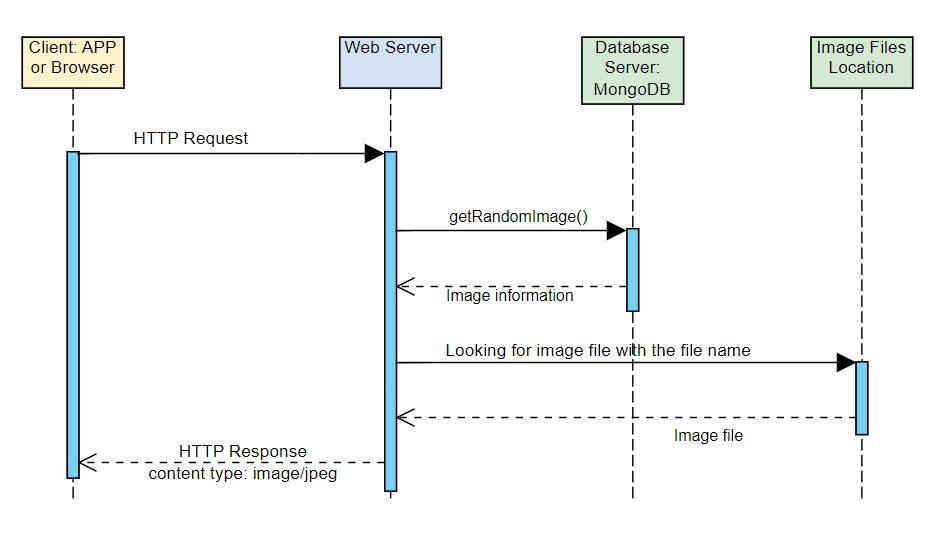

# Random Image Generator API
This API is a microservice used for generating a random image for my partner's project.

## How to programmatically REQUEST data from this API:
If you want to get a random image from the database, you will send a HTTP GET request
to the server, which is http://localhost:5000/random-image
```http
### Get a random image
GET http://localhost:5000/random-image HTTP/1.1
```

## How to programmatically RECEIVE data from this API:
The server will send back a HTTP response with the content type of an image/jpeg.

## UML sequence diagram


## For more uses about this API, please see the CRUD.http file that has more sample calls.